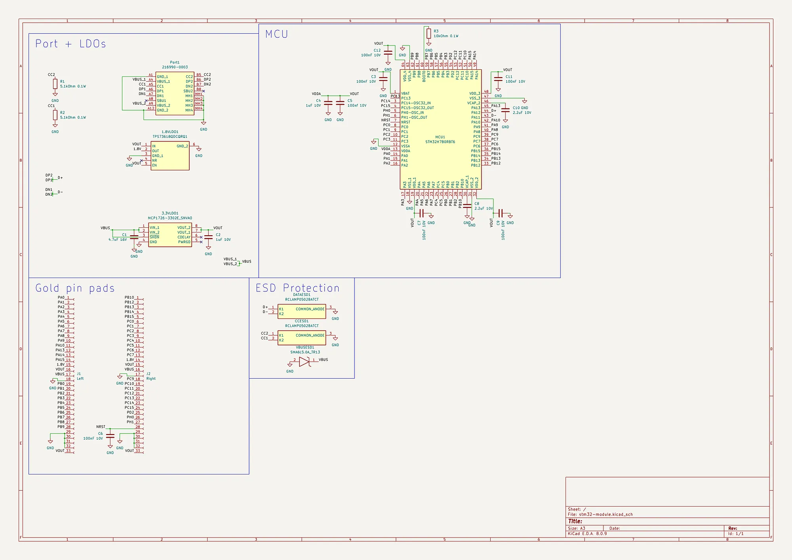
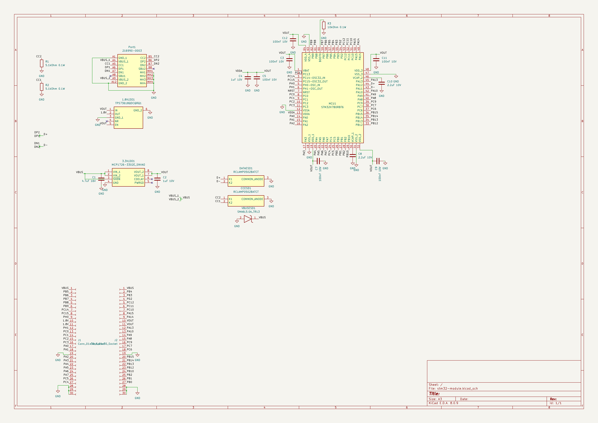
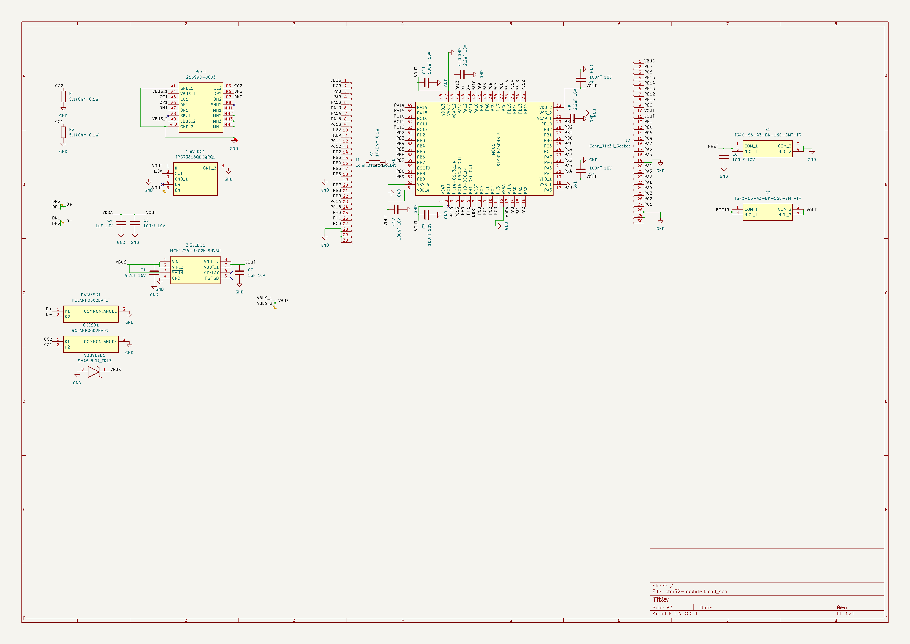
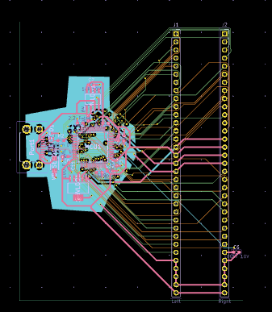
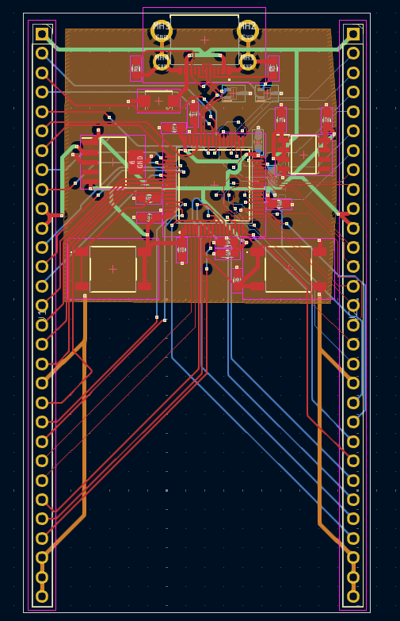

# stm32-module
Hello! This is my first MCU Module, made for HackClub's Blueprint program. It features 66 goldpins, USB-C (USB-FS standard) port for data AND power, integrated 3.3V and 1.8V LDO and ESD protection on VBUS, DATA channels and CC channels! It uses 4 layer pcb (Front and Back are for power, IN1 and IN2 for GPIO connection). It uses STM32H7 64-LQFP Package MCU on it!
# Images

# Datasheets & part list
Here you can find datasheet for every part and exact part number for it i used:
- MCU: [STM Electronics STM32H7B0RBT6 LQFP-64 Package](Datasheets/STM32H7B0RBT6.pdf)
- USB-C Port: [Molex 216990-0003](Datasheets/216990-0003.pdf)
- DATA and CC lines ESD diodes: [Semtech RCLAMP0502BATCT](Datasheets/RCLAMP0502BATCT.pdf)
- VBUS line ESD diode: [Yageo SMA6L5.0A_TR13](Datasheets/SMA6L5.0A_TR13.pdf)
- 3.3V LDO: [Microchip MCP1726-3302E_SNVAO](Datasheets/MCP1726-3302E_SNVAO.pdf)
- 1.8V LDO: [Texas Instruments TPS73618QDCQRQ1](Datasheets/TPS73618QDCQRQ1.pdf)
- 4.7uF 16V Capacitor: [Murata Electronics GRM188Z71C475KE21D](Datasheets/GRM188Z71C475KE21D.pdf)
- 1uF 10V Capacitor: [Walsin 0603B105J100CT](Datasheets/0603B105J100CT.pdf)
- 100nF 10V Capacitor: [Vishay VJ0603Y104JXQCW1BC](Datasheets/VJ0603Y104JXQCW1BC.pdf)
- 2.2uF 10V Capacitor: [Samsung Electro-Mechanics CL10B225KP8NNWC](Datasheets/CL10B225KP8NNWC.pdf)
- 5.1kOhm 0.1W Resistor: [Bourns CR0603-FX-5101ELF](Datasheets/CR0603-FX-5101ELF.pdf)
- 10Ohm 0.1W Resistor: [Vishay CRCW060310K0DHEAP](Datasheets/CRCW060310K0DHEAP.pdf)
- BOOT and NRST buttons: [Same Sky TS40-66-43-BK-160-SMT-TR](Datasheets/TS40-66-43-BK-160-SMT-TR.pdf)
# Q&A (no one said that but I want to include that lol)
> Traces look ugly

It is my second completed project overall. Also they weren't like high speed eg pcie so I just connected them as well as I can! I will try to make them nicer before production, but no promises. EDIT: Tried to make them nicer when rerouting everything, it worked like you can see.