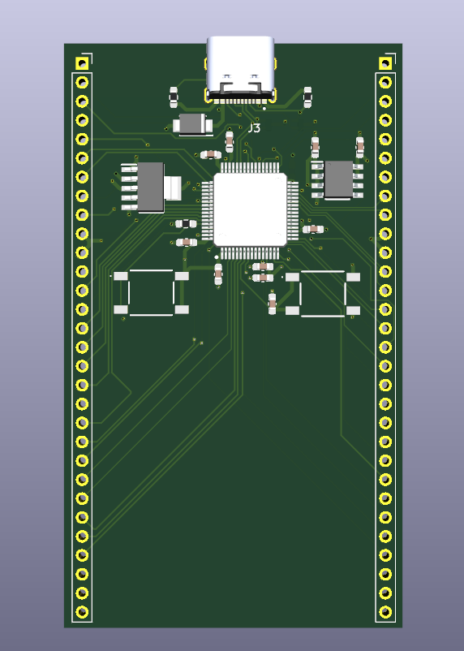

# stm32-module
Hello! This is my first MCU devboard, made for HackClub's Blueprint program. It features 66 goldpins, USB-C (USB-FS standard) port for data AND power, integrated 3.3V and 1.8V LDO and ESD protection on VBUS, DATA channels and CC channels! It uses 4 layer pcb (Front and Back are for power, IN1 and IN2 for GPIO connection). It uses STM32H7 64-LQFP Package MCU on it! I made it so I can have some devboard on hand as one-for-all. This is why theres so much power in this thing (384MHz!!!) and this many GPIO ports, and also why this has 1.8V LDO. You use it like any other devboard, **but note that it probably wont fit on breadboard, as it doesnt have the required distance present between connectors**

## Why i made it?

I thought it will be good learning project as well as giving me access to prototyping with mcu before commiting to making pcb. And i was right!

## What i learned:

Mainly how to deal with tight connection layout on PCB near MCU

# Images
Schematic v1 (old)

Schematic v1.5 (new, work in progress)

Schematic v2 (new)

PCB v1 (old, view via kicanvas so low quality screenshot, sorry)

PCB v2 (new)

3D (new)

# Datasheets & part list
Here you can find datasheet for every part and exact part number for it i used:
- MCU: [STM Electronics STM32H7B0RBT6 LQFP-64 Package](Datasheets/STM32H7B0RBT6.pdf)
- USB-C Port: [SHOU HAN TYPE-C 16PIN 2MD(073)](Datasheets/TYPE-C-16PIN-2MD(073).pdf)
- DATA and CC lines ESD diodes: [Semtech RCLAMP0502BATCT](Datasheets/RCLAMP0502BATCT.pdf)
- VBUS line ESD diode: [Yageo SMA6L5.0A_TR13](Datasheets/SMA6L5.0A_TR13.pdf)
- 3.3V LDO: [Microchip MCP1726-3302E_SNVAO](Datasheets/MCP1726-3302E_SNVAO.pdf)
- 1.8V LDO: [Texas Instruments TPS73618QDCQRQ1](Datasheets/TPS73618QDCQRQ1.pdf)
- 4.7uF 16V Capacitor: [Murata Electronics GRM188Z71C475KE21D](Datasheets/GRM188Z71C475KE21D.pdf)
- 1uF 10V Capacitor: [Walsin 0603B105J100CT](Datasheets/0603B105J100CT.pdf)
- 100nF 10V Capacitor: [Vishay VJ0603Y104JXQCW1BC](Datasheets/VJ0603Y104JXQCW1BC.pdf)
- 2.2uF 10V Capacitor: [Samsung Electro-Mechanics CL10B225KP8NNWC](Datasheets/CL10B225KP8NNWC.pdf)
- 5.1kOhm 0.1W Resistor: [Bourns CR0603-FX-5101ELF](Datasheets/CR0603-FX-5101ELF.pdf)
- 10Ohm 0.1W Resistor: [Vishay CRCW060310K0DHEAP](Datasheets/CRCW060310K0DHEAP.pdf)
- BOOT and NRST buttons: [SHOU HAN TS6643TP 250gf 009](Datasheets/TS6643TP-250gf-009.pdf)
# Q&A (no one said that but I want to include that lol)
> Traces look ugly

It is my second completed project overall. Also they weren't like high speed eg pcie so I just connected them as well as I can! I will try to make them nicer before production, but no promises. EDIT: Tried to make them nicer when rerouting everything, it worked like you can see.
# BOM
|Item                          |Description                 |Needed|Ordered|Why more/less?             |Unit Price ($)|Total Price ($) |URL                                              |
|------------------------------|----------------------------|------|-------|---------------------------|--------------|----------------|-------------------------------------------------|
|ST STM32H7B0RBT6              |MCU                         |1     |1      |-                          |10.08$        |10.08$          |https://www.lcsc.com/product-detail/C730226.html |
|SEMTECH RCLAMP0502BATCT       |CC and DATA lines esd       |2     |5      |5 is minimal order amount  |0.24$         |1.21$           |https://www.lcsc.com/product-detail/C117553.html |
|Littelfuse SMA6L5.0A          |VBUS line esd               |1     |1      |-                          |0.79$         |0.79$           |https://www.lcsc.com/product-detail/C1974860.html|
|MICROCHIP MCP1726-3302E/SN    |3.3V LDO                    |1     |1      |-                          |2.22$         |2.22$           |https://www.lcsc.com/product-detail/C635928.html |
|TI TPS73618QDCQRQ1            |1.8V LDO                    |1     |1      |-                          |1.54$         |1.54$           |https://www.lcsc.com/product-detail/C2877946.html|
|muRata GRM188Z71C475KE21D     |4.7uF capacitor             |1     |10     |10 is minimal order amount |0.07$         |0.68$           |https://www.lcsc.com/product-detail/C389010.html |
|Walsin 0603B105J100CT         |1uF capacitor               |2     |2      |-                          |0.03$         |0.06$           |https://www.lcsc.com/product-detail/C3841036.html|
|VISHAY VJ0603Y104JXQCW1BC     |100nF decap capacitor       |7     |10     |sold in increments of 5    |0.08$         |0.81$           |https://www.lcsc.com/product-detail/C3834925.html|
|SAMWHA CS1608X7R225K100NRB    |2.2uF capacitor             |2     |100    |100 is minimal order amount|0.0068$       |0.68$           |https://www.lcsc.com/product-detail/C516003.html |
|BOURNS CR0603-FX-5101ELF      |5.1kOhm 0.1w CC resistor    |2     |10     |10 is minimal order amount |0.0051$       |0.05$           |https://www.lcsc.com/product-detail/C2076779.html|
|VISHAY CRCW060310K0DHEAP      |10kOhm pull-up/down resistor|2     |5      |5 is minimal order amount  |0.12$         |0.58$           |https://www.lcsc.com/product-detail/C3917708.html|
|SHOU HAN TS6643TP 250gf 009   |BOOT and NRST button        |2     |50     |50 is minimal order amount |0.0167$       |0.84$           |https://www.lcsc.com/product-detail/C5342967.html|
|SHOU HAN TYPE-C 16PIN 2MD(073)|USB-C plug                  |1     |20     |20 is minimal order amount |0.06$         |1.26$           |https://www.lcsc.com/product-detail/C2765186.html|
|PCB                           |PCB                         |1     |5      |5 is minimal order amount  |-             |7$+1.5$ delivery|https://jlcpcb.com/                              |

